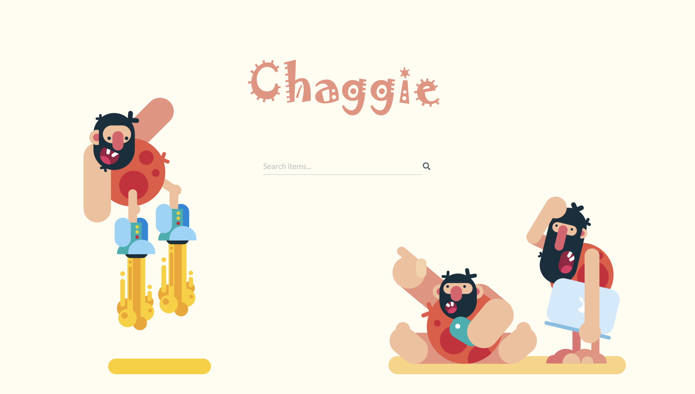
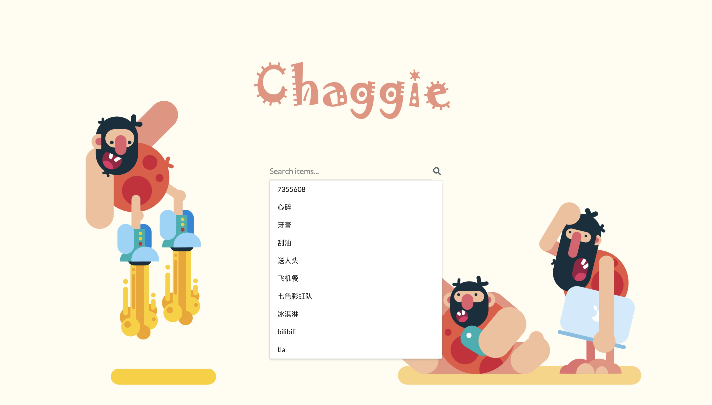
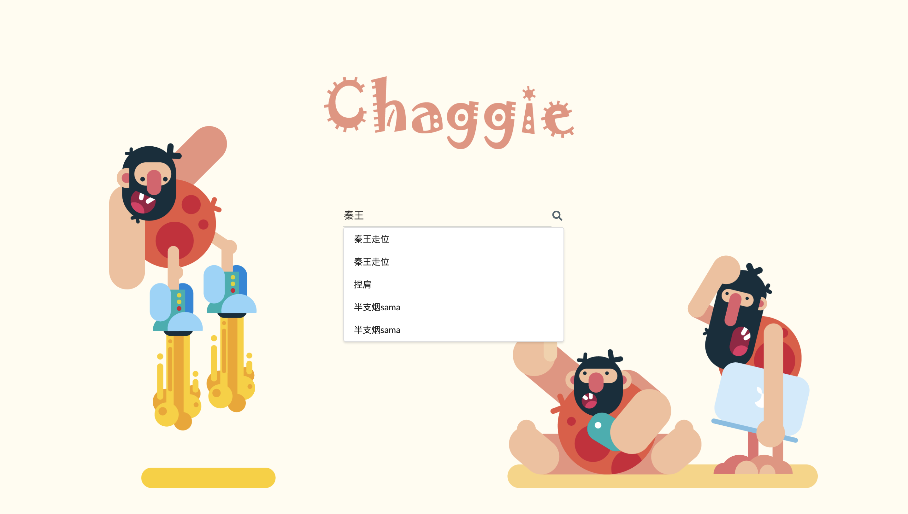
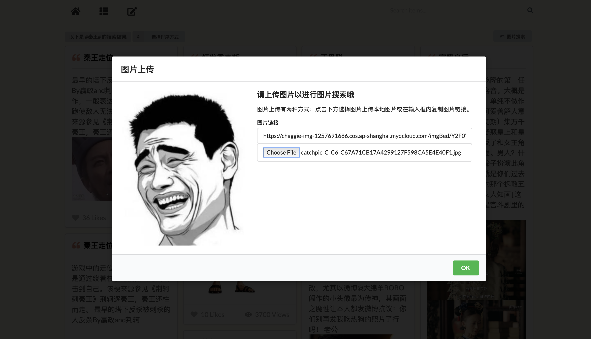

## Chagggie Search Engine

### General

This project is a  hot word search engine. It crawls the images from the [chicken dictionary](https://jikipedia.com/), [bilibli](https://www.bilibili.com/) and Weibo. We integrate the data and stored it into Elasticsearch (a distributed search engine based on lucene) for retrieval. This project currently supports advanced features such as smart recommendation, multi-dimensional sorting, and image searching.
The code in this respository only contains the backend and the api. If you are interested in the front-end and the designing style, please visit https://github.com/Sylvie-Hsu/Chaggie . And the code of crawler is in the repository https://github.com/Riroaki/Meme-Crawler

### Version

- Elasticsearch 6.4（IK analyzer for Chinese）
- Springboot 2.1.6
- Mongodb 4.0.8

### Maven configuration

- Clone the project
- Use mvn  to install the dependencies.

### Resources

We used six aliyun or tencent servers. Three are for ES and two for the picture search. One is used to run the project.

### Usage

1. You need to first configure your elasticseatch
2. You should create the index in the ES using the command in es_command.md
4. Configure the port and index of es, mongoldb in the project file resources/application.properties
5. Now you can create a project in IntelliJ IDEA and import the files of src and pom.xml
5. I only give some data examples in the folder *merged*. Sorry about that I can't offer all the 6400 entries and 10w+ picutures.

### Preview

1. The main search page.

2. If you text nothing in the textbox, we'll recommend something for you .

3. If you text some words, we can guess what you want to search.

4. This is the result, and you an sort it in different dimensions.

5. If you enter an entry, you can see the detailed information of this entry.

6. Finally, the picuture search.

Here is a demo: http://106.14.227.30/chaggie/

And you can also watch the demo video from  https://www.bilibili.com/video/av59969587/

### Authors

This project is developed by four persons, they are @[Sylvie-Hsu](https://github.com/Sylvie-Hsu) @[Riroaki](https://github.com/Riroaki) @[Richard_Jei](https://github.com/Sossmc) @[yangyueren](https://github.com/yangyueren).
In the project, I take responsibility for backend development and elasticsearch.
